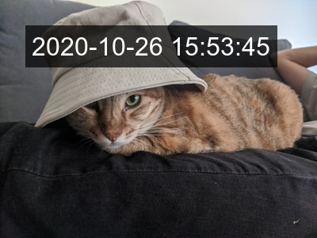

= timestamp_maker

`timestamp_maker` is a command-line tool that adds timestamp on assets/videos based on their creation time.

It looks up the following metadata (ex. EXIF) of the file:

. Creation time
. GPS coordinate
. Time offset

[link="https://github.com/tonytonyjan/timestamp_maker/actions/workflows/test.yml"]
image::https://github.com/tonytonyjan/timestamp_maker/actions/workflows/test.yml/badge.svg[]

== Prerequisite

. https://ffmpeg.org/[FFmpeg] with both https://www.freedesktop.org/wiki/Software/fontconfig/[Fontconfig] and https://www.freetype.org/[FreeType] enabled
. https://imagemagick.org/index.php[ImageMagick]
. https://www.iana.org/time-zones[tzdata]

By default, ImageMagick uses https://en.wikipedia.org/wiki/Helvetica[Helvetica] font.
You should either install it or use `--font-familiy` to speicy another font in your system.

== Installation

[source,sh]
----
gem install timestamp_maker
----

== Usage

=== Quick Start

[source,sh]
----
timestamp assets/in.jpg assets/out-1.jpg
----

[source,sh]
----
timestamp assets/in.mp4 assets/out-1.gif
----

image::assets/out-1.gif[]

=== Customize Appearance

[source,sh]
----
timestamp \
  --format '臺北時間：%Y/%m/%d %H:%M:%S' \
  --font-padding 2 \
  --font-family 'Noto Sans Mono CJK TC' \
  --font-size 16 \
  --font-color black \
  --background-color '#FFFFFFB7' \
  --coordinate-origin bottom-right \
  -x 6 -y 6 \
  assets/in.jpg assets/out-2.jpg
----

=== Customize Time

[source,sh]
----
timestamp \
  --time-zone America/New_York \
  --time '2017-03-12T01:59:56-05:00' \
  assets/in.mp4 assets/out-2.gif
----

image::assets/out-2.gif[]

It handles daylight saving time for you. :)

Run `timestamp --help` for more information.

=== Configure `TimestampMaker` instance

[source,sh]
----
timestamp -r ./config.rb in.mp4 out.mp4
----

.`config.rb`
[source,ruby]
----
TimestampMaker.instance =
  TimestampMaker.new(mime_recognizer: @my_recognizer)
----

== API

[source,ruby]
----
require 'timestamp_maker'

TimestampMaker.new.add_timestamp(input_path, output_path)
----

The snippet above is equivalent to:

[source,ruby]
----
require 'timestamp_maker'

TimestampMaker.new.add_timestamp(
  input_path, output_path,
  format: '%Y-%m-%d %H:%M:%S',
  time: nil,
  font_size: 32,
  font_family: 'Sans',
  font_color: 'white',
  background_color: '#000000B3',
  time_zone: nil,
  coordinate_origin: 'top-left',
  x: 32,
  y: 32,
  font_padding: 8
)
----

=== Customize MIME Type Recognizer

[source,ruby]
----
class FileMime
  def recognize(path)
    command = %W[file --brief --mime-type #{path}]
    stdout_string, status = Open3.capture2(*command)
    stdout_string
  end
end
TimestampMaker.new(mime_recognizer: FileMime.new)
----

=== Customize Timezone Lookuper

By default, `timestamp_maker` uses https://github.com/zverok/wheretz[`wheretz`] to find IANA timezone by given latitude/longitude offline.

Unfortunately, `wheretz` is not under active maintenance and its' database would outdate some day.
We can replae `wheretz` to other more reliable tools like GeoName, for example:

[source,ruby]
----
require 'timestamp_maker/time_zone_lookupers/geo_name'
TM = TimestampMaker
lookup = TM::TimeZoneLookupers::GeoName.new(username: 'YOUR_USERNAME')
TM.new(
  handlers: [
    TM::Handlers::ImageMagick.new(time_zone_lookuper: lookup),
    TM::Handlers::Ffmpeg.new(time_zone_lookuper: lookup)
  ]
)
----
