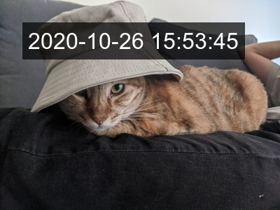

= timestamp_maker

`timestamp_maker` is a command-line tool that adds timestamp on images/videos based on their creation time.

== Prerequisite

. https://ffmpeg.org/[FFmpeg]
. https://imagemagick.org/index.php[ImageMagick]

== Installation

[source,sh]
----
gem install timestamp_maker
----

== Usage

=== Quick Start

[source,sh]
----
timestamp images/in.jpg images/out-1.jpg
----

=== Customize Appearance

[source,sh]
----
timestamp \
  --format '臺北時間：%Y/%m/%d %H:%M:%S' \
  --font-padding 2 \
  --font-family 'Noto Sans Mono CJK TC' \
  --font-size 16 \
  --font-color black \
  --background-color '#FFFFFFB7' \
  --coordinate-origin bottom-right \
  -x 6 -y 6 \
  images/in.jpg images/out-2.jpg
----

=== Customize Time

[source,sh]
----
timestamp \
  --time-zone Asia/Tokyo \
  --time 1989-11-23T11:23:00Z \
  images/in.jpg images/out-3.jpg
----

Run `timestamp --help` for more information.

=== Use with Ruby

[source,ruby]
----
require 'timestamp_maker'

TimestampMaker.add_timestamp(input_path, output_path)
----
